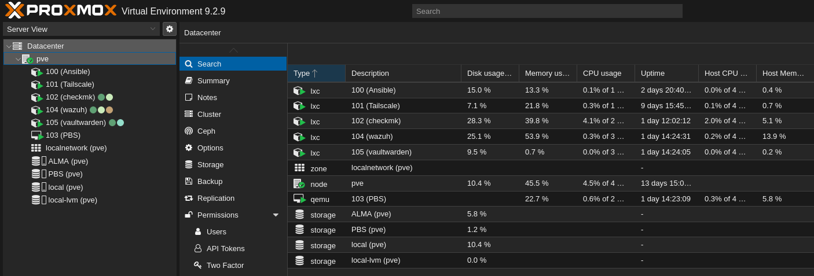
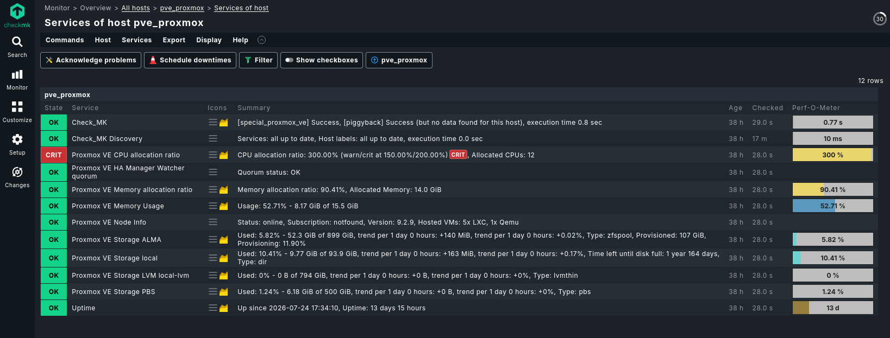
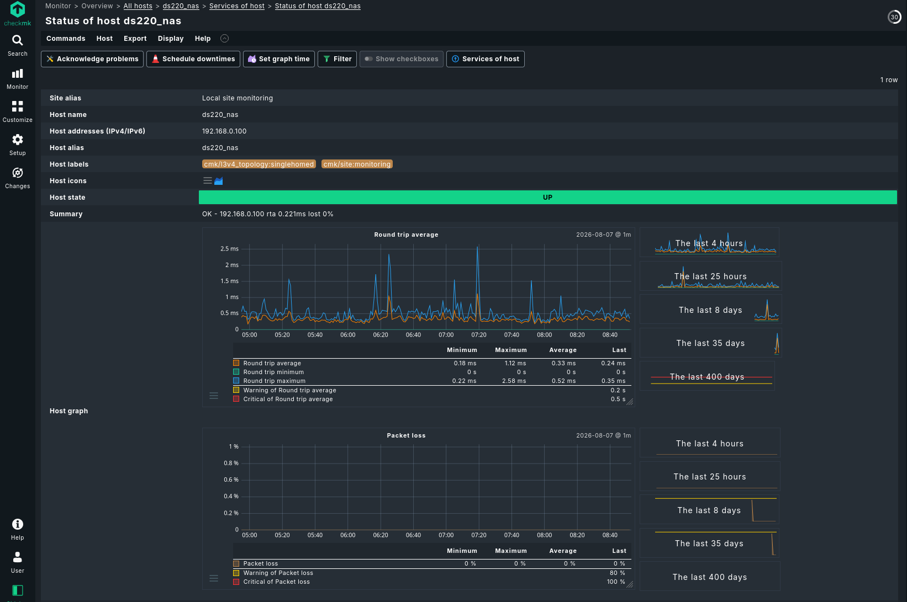
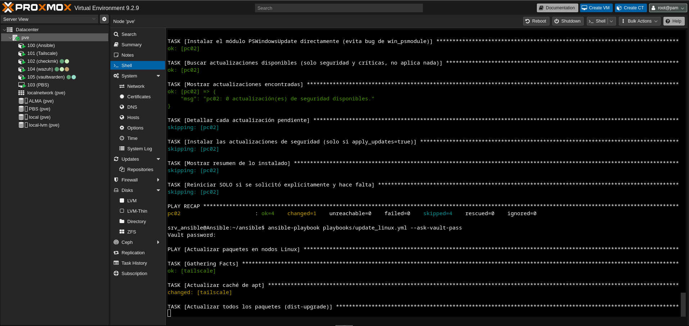
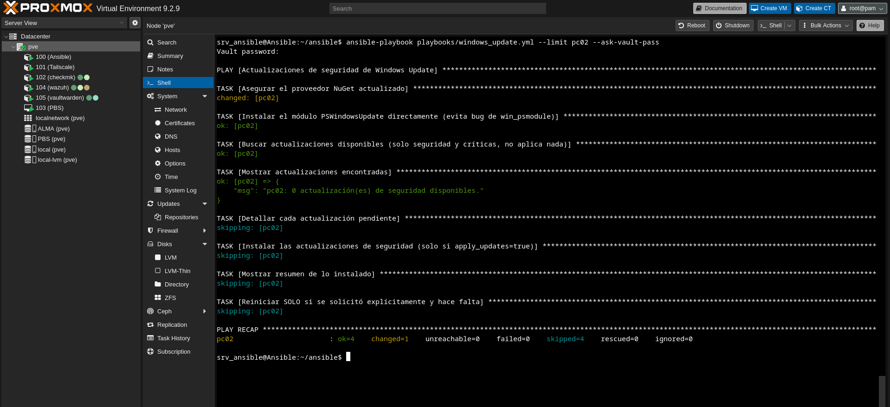
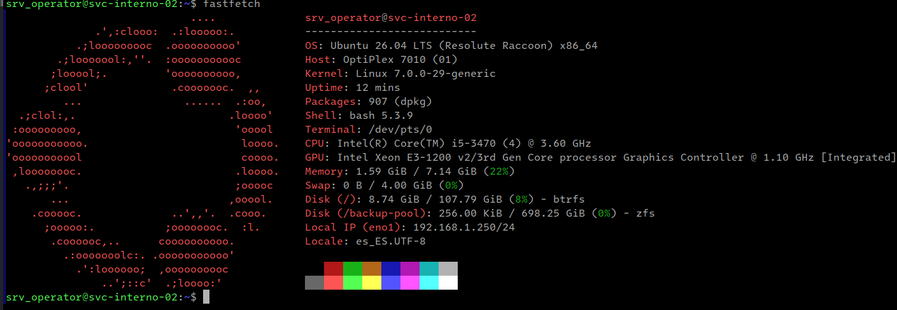
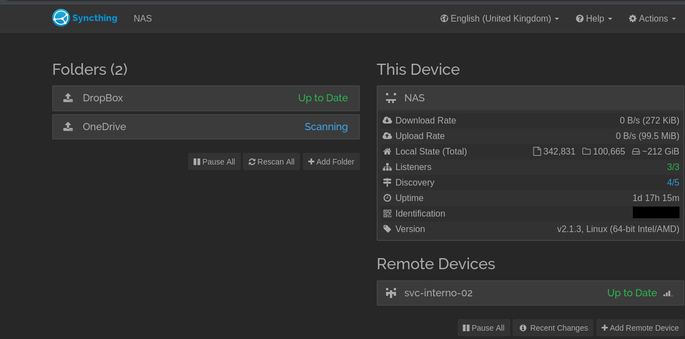
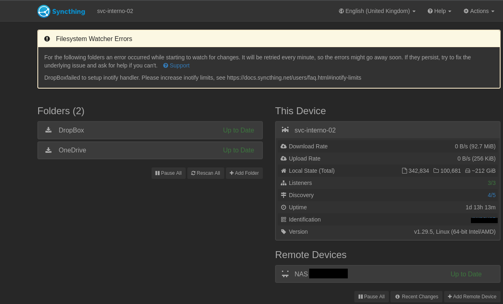

After posting my [earlier project](https://polar-node.work/posts/paid-in-groceries/), where I pulled a small, open-source infrastructure out of a hat for a small business that had nothing and now has real infrastructure, some people reached out and started asking questions. One of those turned into a hands-down agreement on a job.

### A tight budget and no Windows Domain

One of the people who reached out was a business owner I know personally. They run a small local company with about 10 Windows PCs, a few printers, one NAS, and a lot of sensitive data handled daily. Budget is tight, and the owner has no interest in cloud-based identity services like Azure AD or M365.

When I first assessed the environment, the picture was clear. There was no proper backup strategy. Passwords were written on yellow sticky notes in the open. No alerts, no centralized administration, no idea if anything was wrong. Nobody knew if a computer had a failing SSD or was throttling because it overheated. Everything simply worked, until it did not, and everything was reactive. There was no SIEM either.

The lack of individual identity was another gap. Without user accounts tied to real people, there was no way to know who accessed what. Several alternatives were evaluated. Samba AD DC requires joining every PC to a domain, which changes how every user logs in. For 10 machines, the overhead of maintaining a domain controller (DNS, Kerberos, GPO, replication) is hard to justify. Univention Corporate Server was considered as a more integrated option, but it still requires domain-joined PCs with the same login workflow change. Synology Directory Server was also evaluated, but the NAS hardware (a Celeron with 2 threads) is too limited to run both storage services and a directory service reliably, and it still does not solve multi-factor authentication for cloud services like OneDrive and Dropbox, which is the actual risk.

The real obstacle, though, is not technical. Both the owner and the employees resist changes to how they work daily. Any solution that modifies the login screen or adds a step to their routine gets rejected before it can be tested. But that is a topic for another post.

So the identity gap remains open. I am still looking for something that fits this specific context: small scale, no domain join, minimal workflow disruption, no SaaS dependency. The project is far from over.

### Choosing to be uncomfortable

So I decided to implement a full-blown open-source stack on a Proxmox host, installed on a spare, pretty decent HP EliteDesk machine.

When it comes to monitoring. I'm mostly a Zabbix person, but the point here was to be deliberately uncomfortable: learning comes from that. I chose CheckMK as the monitoring stack for two reasons: it has built-in graphs, dashboards, and discoverability, and I wanted to run it in production after dabbling with it in my homelab, to diversify my monitoring stack.

Pairing CheckMK with Ansible-driven deployment fit the constraint well. I wanted less time spent building graphs and dashboards, and better service discovery and alerting out of the box.

This job didn't feel any different from the previous one. The difference this time was a slightly better stack, and, I'll say it, a slightly better budget.

### The open-source stack

On the Proxmox host, I deployed the following as isolated containers and VMs:

Ansible handles orchestration on both Linux and Windows machines, including deploying to Windows over OpenSSH instead of relying on the clunkier WinRM.
Vaultwarden replaces the sticky notes: an open-source, trustworthy password manager, self-hosted at no license cost.
Wazuh because a SIEM doesn't have to cost a lot of money; security should be within reach at small-business scale.
Tailscale because it works simply, without opening ports or leaving the firewall exposed.
Proxmox Backup Server because it integrates natively with Proxmox, and backups are non-negotiable.

If any of these prove their value to the owner over time, the plan is to upgrade to a licensed or enterprise version where one makes sense, budget allowing.

On the NAS already in place, I added Snipe-IT for asset inventory, LubeLogger for fleet cost tracking, and AdGuard for network-wide ad and tracker filtering, all deployed as Docker containers, managed through Portainer.

For the offsite piece, I deployed Ubuntu 26.04 LTS on a spare PC, kept in a separate physical location as the third copy in the 3-2-1 strategy. Nobody at the business even knows it exists. The host runs on Btrfs with Snapper, giving automatic rollback if an update breaks the system.

For the data itself, it runs a ZFS pool with immutable snapshots as ransomware protection: even if everything else is compromised, that copy cannot be altered or deleted. It is reachable only via Tailscale, with access scoped through Tailscale ACLs and further restricted with UFW, no exposed ports. Hardened with CrowdSec as an active firewall complement alongside fail2ban, and enrolled in Ubuntu Pro's free tier for extended security maintenance.

Cost: the hardware (already owned), my time and expertise, and electricity.

Scope: 10 Windows machines, 6 Linux containers, one Linux VM, and one remote Linux server.

Agent deployment was automated via Ansible, same methodology carried over from the first project.

### Where I got tripped up

Adding new hosts in CheckMK (Community edition) was the biggest early challenge. It's easy to miss the "Accept" step, without which CheckMK won't start pulling metrics from a validated host or its discovered services.

### In practice

### Why bother being uncomfortable

Nothing beats real experience and learning from small failures. Trying new things keeps my focus sharp: it consolidates core principles while honing new skills. I knew going in that the reward would be worth it: value added to the business, getting paid, and lessons learned from a new project. I am constalty searching to be challanged.

One phrase stuck wit me from early childhood: "Sharpest knives needs to be  sharpened on hardest rocks"

### Does this count as real job experience?

Some will say this doesn't equate to a "real" job done in an office. But isn't a hardened, battle-tested, hands-on sysadmin exactly what everyone wants: someone who can implement, troubleshoot, document, and explain in a few words what, why  and how it all adds value to the business owner, without drowning them in technical detail?

If this isn't experience, I don't know what is.

### Lessons learned, the hard way

Smooth seas never made good sailors. No blog post can really show what a project like this takes. The patience when things break at the worst possible time. Biting your tongue when a decision you warned against lands back on your desk as an emergency. Keeping your head down when the same problem comes back for the third time. Finding a way forward when the answer is "there is no money for that."

Ten PCs might not sound like a lot, but when a business runs on them every day, one down means 10% of the work stops. The pressure is not about how big the company is. It is about what breaks and what it costs them.

A dead disk in a large company gets a ticket, a team, a runbook, and a shelf full of spares. A dead disk here means me, no spare, no one to call, and someone who cannot work until I fix it. I do this alone. I am the project manager, the vendor contact, and the one on the keyboard. There is no queue, no handoff, no "someone else will pick it up." I solve it or it stays broken.

That is why I deliver, every time.

### Next up

Now I'm taking an OpenTelemetry course from the Linux Foundation, yet another challenge, another step in growing my observability stack. My mantra: never stop learning, never stop growing.

And that doesn't mean I'm leaving Zabbix behind, quite the opposite. Using CheckMK this round ,made me appreciate some things from Zabbix,some from the alternative. The more tools in my observability stack, the better. 
