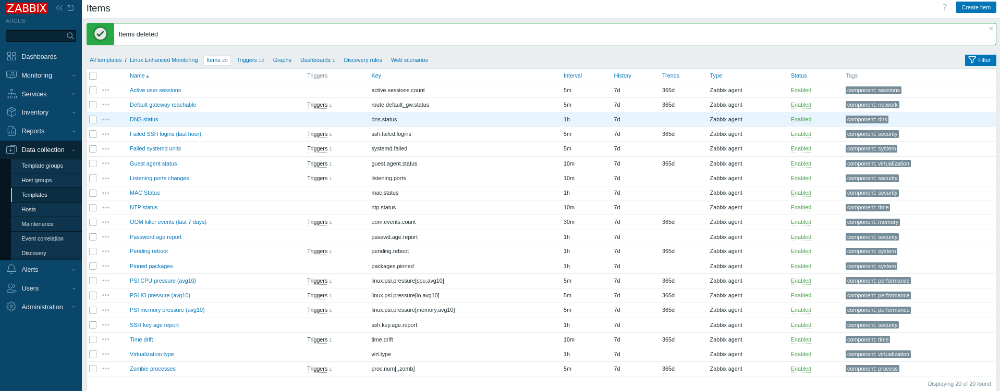
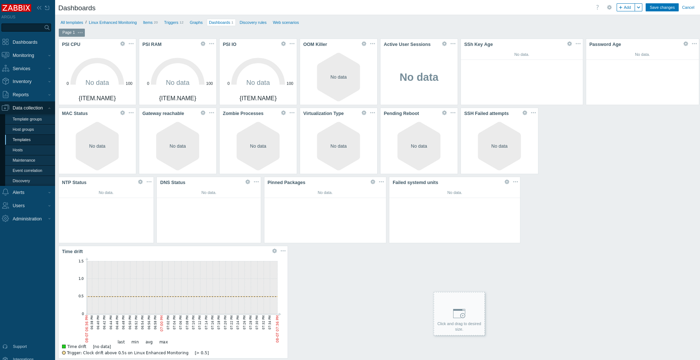
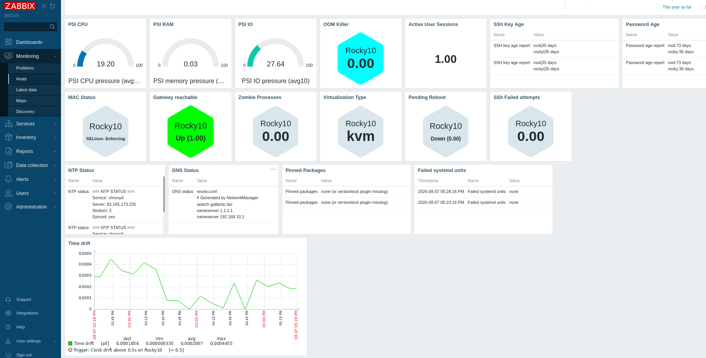

+++
title = "17 Custom Zabbix checks every Linux Admin should have"
date = 2026-08-07
draft = false
categories = ["monitoring", "Infrastructure"]
tags = ["linux", "opensource", "zabbix", "sysadmin"]
description = "A post about extending monitoring scope of Zabbix with custom parameters"
+++

Zabbix's default templates cover the basics pretty well, but accepting only the defaults,  puts you in the spectator seat: green or red, up or down, basic alerting. The moment you want to know in-depth *why* a server feels off, not just *that* something's wrong, you're on your own. As in yo can tweak and get more from Zabbix, but some efforts is required.

Hold your seat, I'll explain myself.

This post covers the metrics I found myself missing, the problems that i faced once I started paying closer attention, and how I closed those gaps with a set of custom user parameters checks.

### Why Custom User Parameters

As a sysadmin, one of the tasks you're presented with is choosing the right tool for the job. But truth be told, a tool is rarely a perfect match, there are always small gaps. Monitoring tools are no different; no single tool covers everything or has a plugin for all you can imagine. Or has it all, but feels "right" for you, in particular.

Sometimes there's a convenient plugin to pull your wanted metric, and Bob's your uncle. But when there isn't one, you're invited (not to say forced) to create your own script, assuming the monitoring platform is open enough to allow it (that's a topic for another discussion).

This was and still is one of my favourite feature of Zabbix: the ability to create your own Custom User Parameters to pull out the exactly metric you want, how you want.
Needless to say, for my particular situation, I created some scripts, linked them to new created item>custom-user-parameters, and put all those in a custom template. And those alone are what led to this post and the repo on my GitHub page.

### What I built

If you're monitoring, you want all the info on as few screens as possible. Moreover, to get that, it touches somehow tangentially one principle. Laziness. Some will shy away from admitting it, but the vast majority of sysadmins are lazy, not couch-potato lazy, but "why open another terminal to pull aditional data if I already have this screen in front of me, just show me everything I need" lazy.

So I wanted the same pane of glass to cover the overlooked, mundane things, too: password age, SSH keypair age, DNS status, time sync drift, and more. In total, 17 checks across three categories: security (SSH keys, failed logins, MAC status), health (PSI, OOM, systemd), and drift (time, pending reboot, pinned packages) that Zabbix Linux default templates does not cover.

### Deep Dive: PSI (Pressure Stall Information)

The default load metrics in Zabbix templates don't really tell the whole story, so I needed something more accurate. PSI is what the big players monitor: PSI for CPU, RAM, and storage gives a clearer, earlier warning of server trouble than load average alone. This one is for you: https://www.linkedin.com/in/josemfh/?locale=es

The easiest way to explain load average is with a traffic analogy: it's like a report that only tells you "there are 12 cars stuck in traffic." Good to know, but not much you can do with it.

Are they stuck because the road itself is too narrow (CPU-bound)?

Because there's a toll booth jam ahead (I/O-bound)?

Because half of those cars pulled over to fill up gas at once (memory pressure)?

Load average won't tell you. It just says something's slow, not why. Zabbix's default load item has the same problem. That's where PSI comes in.

PSI (Pressure Stall Information) is the traffic report that actually tells you what's causing the jam, and for how long: maybe 80% of the delay is the narrow road (CPU), 5% is the toll booth (I/O), and the gas stop barely matters. Or it could be the opposite: the road's wide open, but everyone's stuck filling up gas at the same time. Same 12 cars, same load average, but a completely different fix.

That's the difference between guessing and actually knowing before you even SSH in. With this custom item, Zabbix gives you a clearer picture of your Linux hosts, so you know exactly what to fix and where.

### Deep Dive: MAC Status (SELinux/AppArmor)

In a multi-user, multi-admin/devops environment, things happen. Without pointing fingers, someone will eventually turn off AppArmor or SELinux. You're not supposed to do that in production, but we've all seen it happen (and if we're honest, some of us have done it at 2am chasing a permission error). Better to have it watched, so when it happens, we know who, when, and where. And if you're lucky, or your charisma stat is high enough, you might even get the *why* too, delivered as a wall message sent across the whole infra.If you know, you know.

One thing to be aware of when running those custom checks: add the `zabbix` user to a separate sudoers file with only enough privileges to run it, don't grant more than it needs.

Some screenshots:

## Deployment

The scripts can be deployed via Ansible or other orchestration tools, or you can clone the repo onto your server and get the metrics flowing by following the steps in the Usage section. The Linux Enhanced template yaml file is uploaded as any other template.

Or, use it as a base: create your own improved, modified template from these scripts. You decide which metrics you want or need, and set things up to your liking.

## Lessons learned

Zabbix gives you the opportunity to contribute, build your own vision, metrics, dashboard and offers a solid foundation for it. I took that opportunity in a heartbeat. As so many times before, a problem for me is just an opportunity to learn something new, tackle a new challenge, and get better at something. In IT, you never stop learning, or stop growing.

## Try it yourself

[Zabbix-Custom-Items](https://github.com/polar-node/zabbix-custom-items/tree/main/userparameters/linux) 
