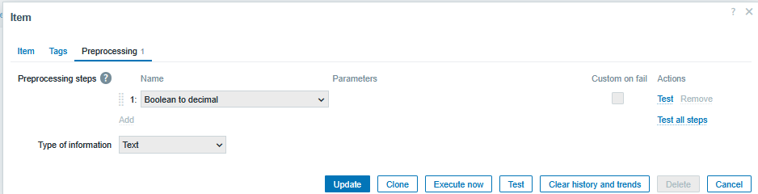

+++
title = "Windows Firewall disabled on multiple hosts. Our monitoring never noticed the change"
date = 2026-06-12
draft = false
categories = ["monitoring", "Infrastructure"]
tags = ["Windows", "opensource", "zabbix", "sysadmin"]
description = "A post about extending monitoring scope of Zabbix with custom parameters"
+++

Windows Firewall disabled on multiple hosts. Our monitoring never noticed the change

A few months back while working with Zabbix for our mixed environment, I realized that the default Windows template doesn't monitor whether Windows Firewall is actually enabled across its three zones (Domain, Private, and Public). There also wasn't a straightforward way to see who was or still is logged into each Windows machine.
For something as critical as firewall status, this felt like an important gap, so I came up with a two-fold solution:

🔒Firewall monitoring: Created UserParameters for each profile using Get-NetFirewallProfile in PowerShell. The boolean output gets processed to 1 or 0, which triggers alerts when any zone goes down.

👤User tracking: Added a simple UserParameter with qwinsta.exe to capture logged-on users in real-time.

The magic happens when these work together. Firewall goes down? I immediately see who was logged in. In a team with multiple admins making changes, having the event and the person behind it in one view has cut our troubleshooting time significantly and made security auditing much more straightforward.

After several months running this in production, it's proven to be one of those small additions that makes a real difference in daily operations. I've integrated this into a custom Windows template that we've tweaked for our infrastructure, trying to strike a balance between observability, performance, and simplicity.

Dear Zabbix team: would love to see firewall monitoring in the default Windows template. This seems like something many users would benefit from out of the box. Happy to contribute if there's interest.

My solution might not be the most elegant or optimized, but it works for us. If you've tackled this differently or have ideas to improve it, I'd love to hear your approach in the comments.

If you want the full UserParameter or template details, happy to share what's been working for us.

