+++
title = "Running dangerous Linux commands, so you don't have to"
date = 2026-10-03
draft = false
categories = ["Bash", "Homelab"]
tags = ["Linux", "opensource", "sysadmin", "debian", "proxmox"]
description = "I ran rm -rf / and rm -rf /* on a throwaway Debian 13 VM and recorded what actually happened, including the safeguard that stopped one of them."
+++

LinkedIn keeps telling me to NEVER run `rm -rf /`, or one of its dangerous cousins. What it never tells me is what actually happens when you do. You get the warning, then a cliffhanger with no ending.

So this series runs them. In a throwaway VM, on a real distro, with the output shown as-is. No screenshots borrowed from other sites, and no "this will destroy your system" without a system actually being destroyed.

For each command you get:

- The environment (distro, kernel, user)
- The exact command
- What actually happened
- The safeguard that stopped it, or the lack of one

Ten commands. One sacrificial VM. Snapshot before, autopsy after. Real tests, real results, no AI slop, so you learn what happens and why to avoid it without running it yourself. No guarantee every episode will be a masterpiece, but it's fun, and it's how I'm learning Linux.

> Don't run any of this on a machine you care about. I'll do the dangerous part so you don't have to.

### Episode 1: `rm -rf /` and `rm -rf /*`

Does it ruin my afternoon, or does the OS say no? Place your bets.

#### TL;DR

| Command | Run as | Result |
|---|---|---|
| `rm -rf /` | regular user | Refused by `rm` |
| `sudo rm -rf /` | root via sudo | Refused by `rm` |
| `rm -rf /*` | [with sudo] | OS wiped; 7 empty directories left at the top level |

#### Test environment

- Hypervisor: Proxmox VE 9.2.20
- VM: full clone of a Debian 13 template,32 GB disk,2 vCPUs,vmbr0,network=DHCP
- Kernel: 6.12.107+deb13-cloud-amd64
- User: `debian`, a regular user with sudo

[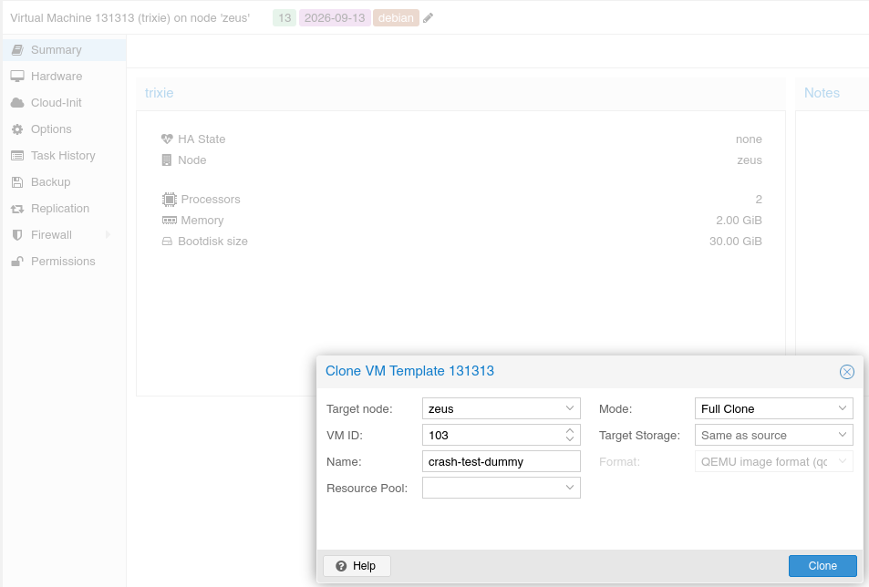](images/1.png)

[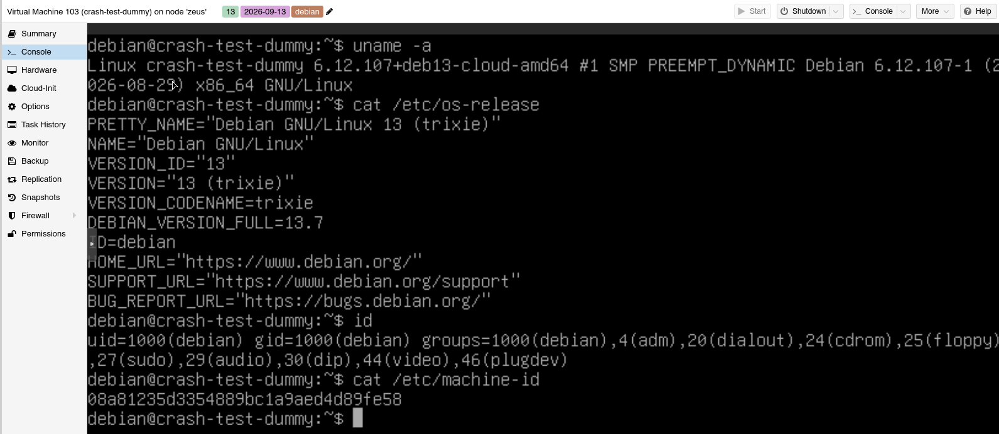](images/4.png)

[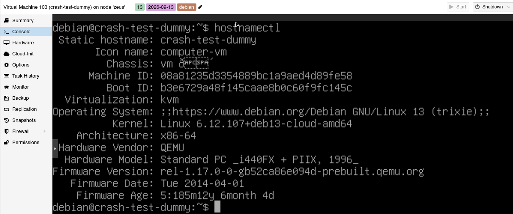](images/5.png)

Before anything else, I took a snapshot so I could roll back after the ordeal.

[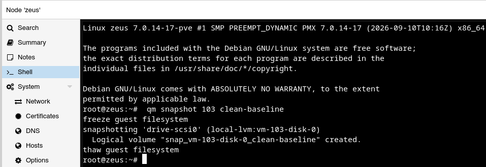](images/6.png)

[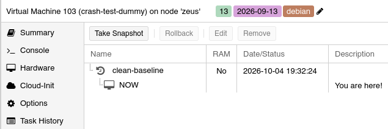](images/7.png)

And a look at the system before the damage, for reference.

[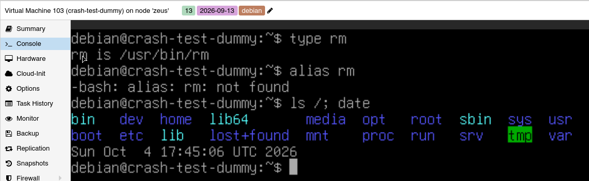](images/8.png)

#### Test 1: `rm -rf /` as a regular user

The moment of truth.

[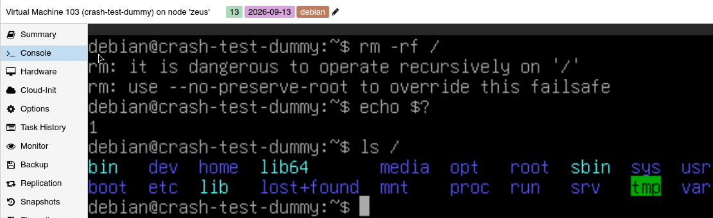](images/11.png)

`rm` refused to run and the system was untouched. The message points at the `--no-preserve-root` flag, so this is a built-in safeguard in `rm`, not a permissions error:

#### Test 2: the same command with sudo

Onwards, let's execute the same comand as sudo. This is where things may get spicy.

[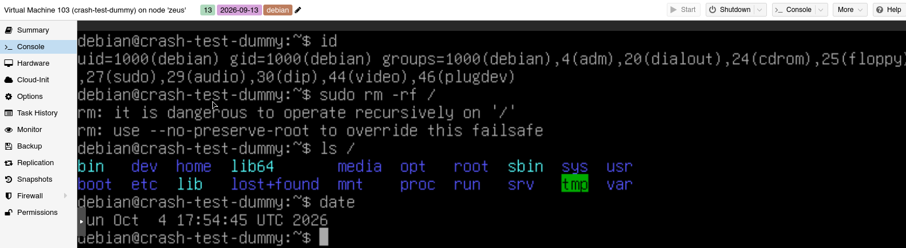](images/13.png)

Same refusal. In this test, `sudo` made no difference.

#### Test 3: `rm -rf /*`

Now a twist. `rm -rf /*` looks almost identical, but it's a different command. The shell expands `/*` into every top-level entry before `rm` even starts, so `rm` never receives a bare `/` to object to. 

With the snapshot in place, there was nothing to be scared of.

I ran it as user debian wth sudo . I didn't capture `rm`'s own output or exit code; the screenshot below was taken seconds after launching it.

[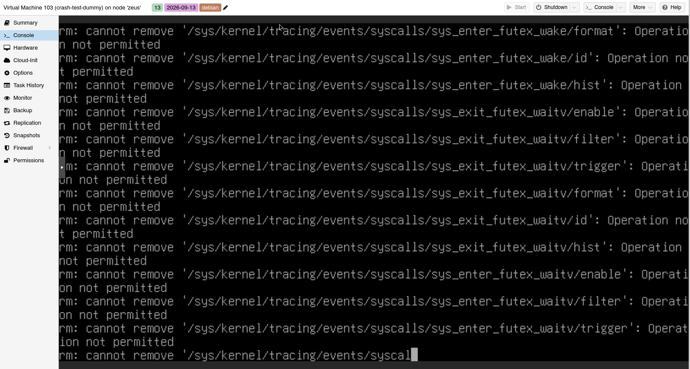](images/14.png)

[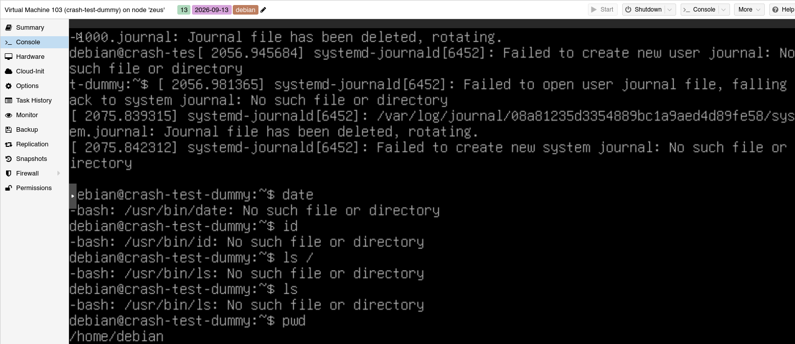](images/15.png)

[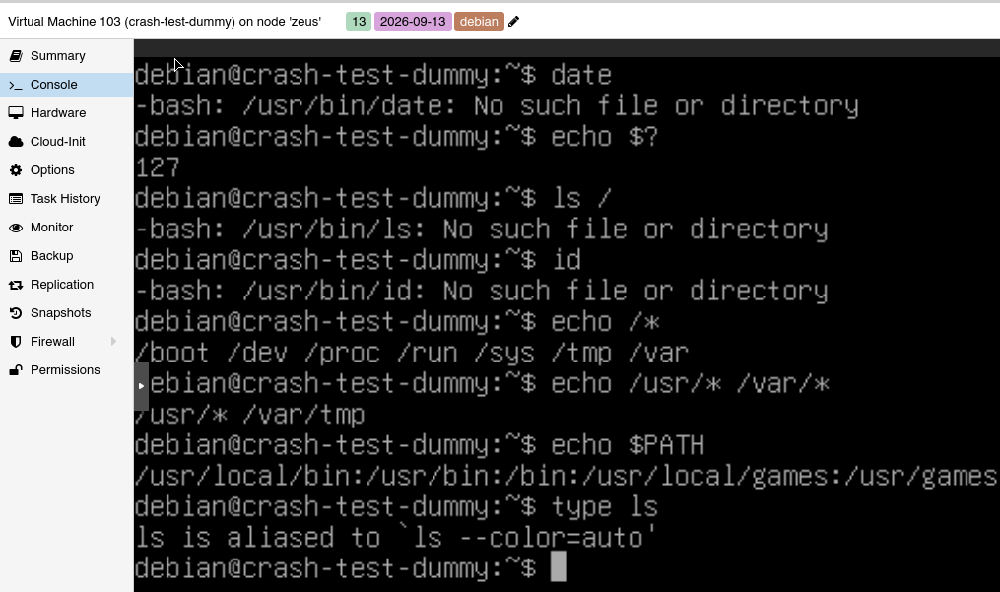](images/17.png)

The shell was still alive, but almost nothing in it worked: `date`, `ls`, and `id` all failed with `No such file or directory`. Shell builtins still ran (presumably because bash was already loaded in memory), and `echo /*` listed only `/boot /dev /proc /run /sys /tmp /var`.

#### The autopsy

To see what was left, I booted the VM from a live ISO and mounted its disk.

[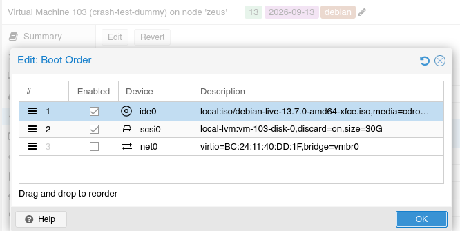](images/18.png)

[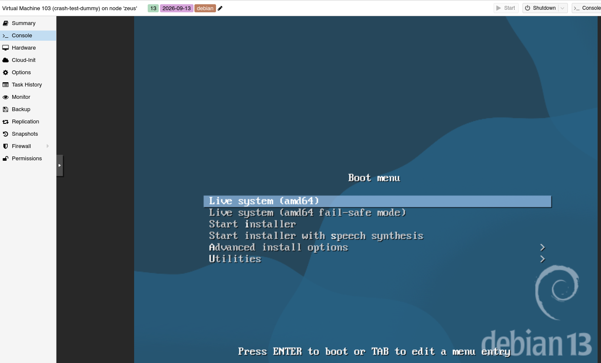](images/19.png)

Mounted the existing VM's disk

[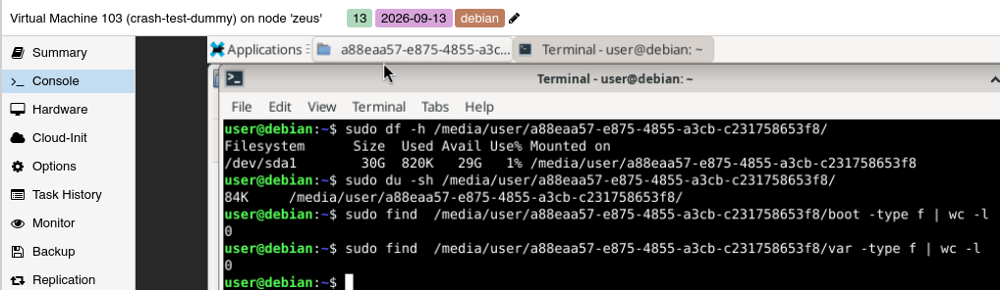](images/22.png)

The root partition (`/dev/sda1`, 30 GB) showed 820 KB used, 1%. Only seven directories remained at the top level, and a search found no regular files in `/boot` or `/var`. Why each of those seven survived is something I haven't verified yet.

#### What I learned

- `rm` has a built-in safeguard against a literal `rm -rf /`, and in this test `sudo` didn't get around it.
- That safeguard did not help against `rm -rf /*`, because `rm` never saw `/`.
- A running shell survives its own binaries being deleted, but can't start anything new.
- Snapshots are why this series exists.

Next episode teaser: the fork bomb, :(){ :|:& };:

#Linux #SysAdmin #DevOps
