+++
title = "I Got Paid in Groceries. Here's What I Built."
date = 2026-07-22
draft = false
categories = ["Projects", "Infrastructure"]
tags = ["linux", "opensource", "devops", "sysadmin", "proxmox", "ansible", "wazuh", "foss"]
description = "A small retailer had no backups, no monitoring, no remote access, and roughly zero budget. Here's what got built with a 12-year-old desktop and open source tools."
+++

A small retailer asked me for help. They had nothing. No backups. No monitoring. No remote access. Budget: roughly zero, or a discount on groceries. They promised.

I said yes. Mostly because I like a good challenge. Partly because the groceries were decent.

What followed was one of the most honest projects I have worked on in years. No safety net. No team to escalate to. No budget for the right tool. Just me, a 12-year-old HP desktop gathering dust, and the question: **what can actually be built with what is here?**

Turns out, quite a lot.

### The architecture

Everything runs on a single HP EliteDesk 800 G1 — a 256GB SSD for the Proxmox host, a 1TB SSD for the live containers, and a 3TB HDD for backups and file shares. One box, six LXC containers, no redundancy to fall back on.

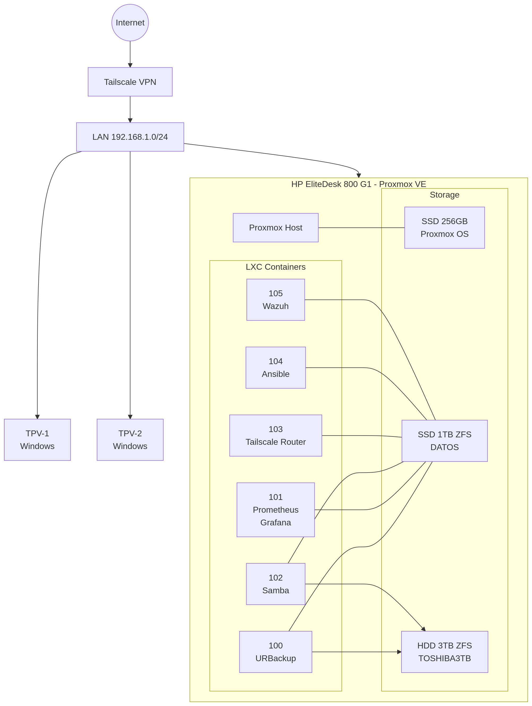

Proxmox for virtualisation. URBackup for bare metal recovery, point-of-sale terminals fully restored in under 30 minutes from a USB drive. Tailscale for encrypted remote access over WireGuard, tested from my phone on 5G outside their network. Wazuh, a full enterprise SIEM, watching every container for vulnerabilities. Prometheus and Grafana for monitoring. Ansible for day-to-day automation. All of it sitting on two SSDs and a hard drive that were already there.

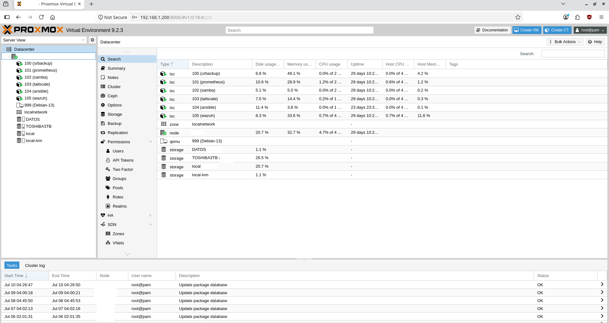

None of this exists without the Linux kernel, GNU toolchain, and thirty years of people building in the open. Not free as in cheap. **Free as in you own the tools.**

Commercial equivalent: hundreds to thousands of euros, plus the annual renewal email nobody enjoys receiving.
Cost here: electricity. And yes, the grocery discount.

### Backups that actually restore

URBackup handles bare metal image backups for both point-of-sale terminals. Both showing green, both restorable from a USB drive in under half an hour if a terminal dies mid-shift.

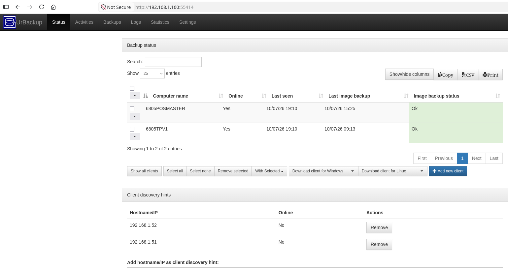

### Monitoring the whole stack

Prometheus scrapes every node and container; Grafana turns it into something you can actually glance at during a coffee break.

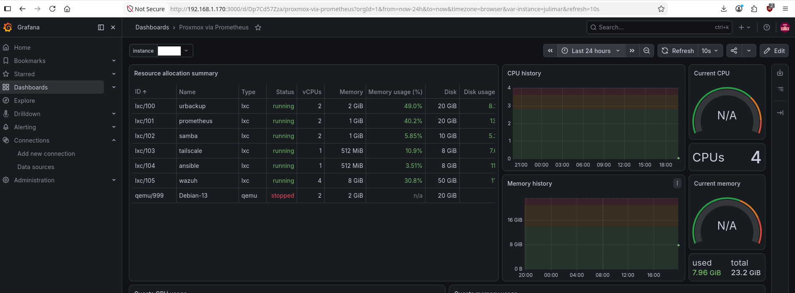

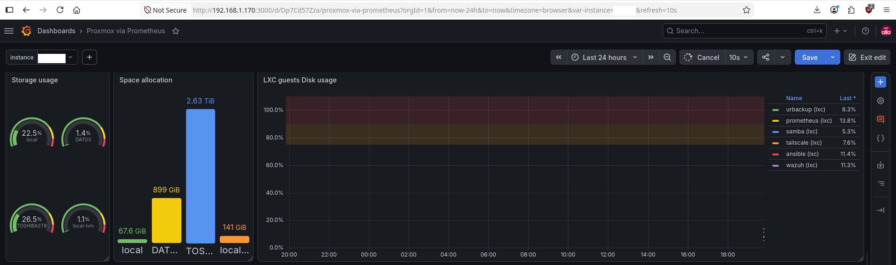

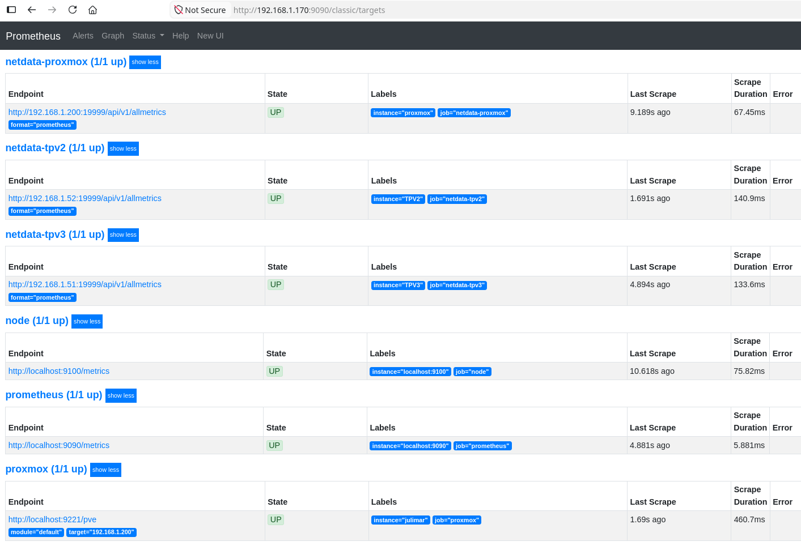

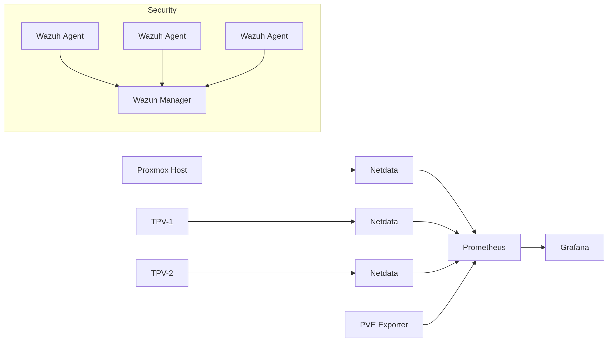

### Watching for what shouldn't be there

Wazuh runs as a full SIEM across all four agents — vulnerability detection, MITRE ATT&CK mapping, CIS compliance scoring, all on hardware that would make most vendors laugh.

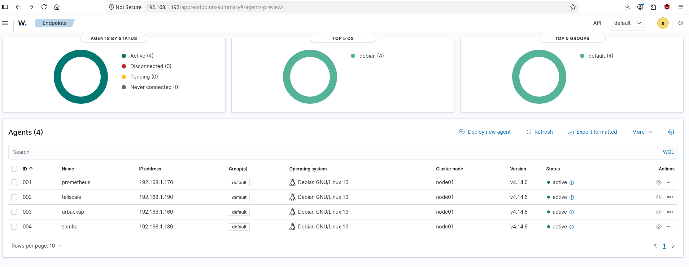

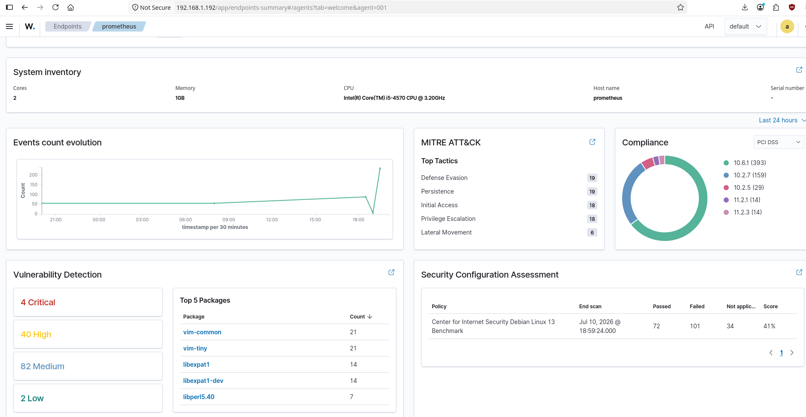

### Automation that isn't pretending to be more than it is

Ansible handles day-2 operations across the fleet — pings, package upgrades, reboots when needed.

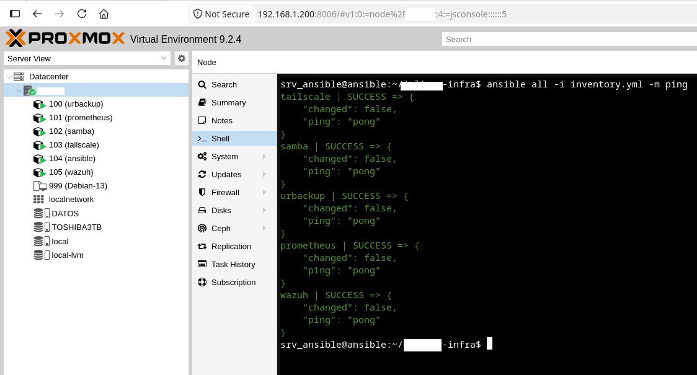

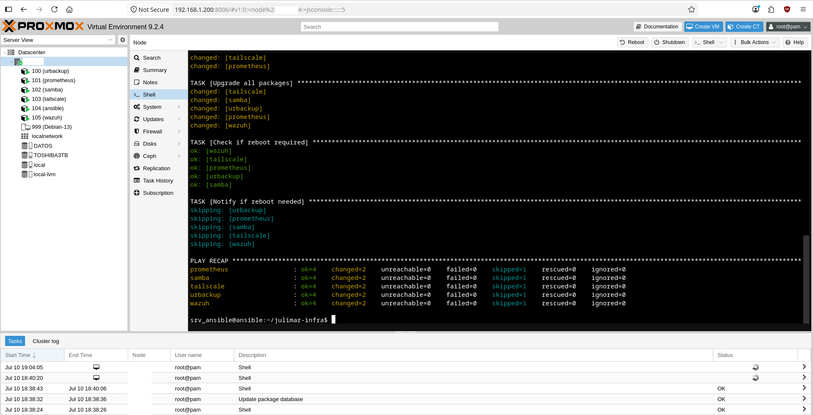

### Where the disks actually go

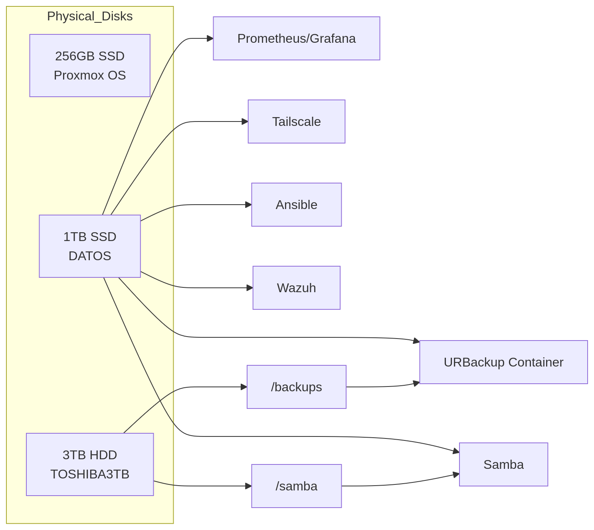

### On the hardware

I know what some of you are thinking. A real engineer would never deploy on hardware that old.

Fair. It is not ideal. But telling a small business they need new hardware before you can help them is not engineering. It is gatekeeping. The hardware is temporary. The architecture is not. Open standards, fully documented, ready to lift onto better metal the day the budget exists.

Everything you see in the screenshots was built manually and configured from scratch. Ansible handles day-2 operations, updates, security hardening, agent deployment. I am not going to dress that up as full IaC when it is not.

### The real question

Recruiters love asking about scale. Kubernetes. Multi-region. Impressive dashboards.

A better question: **can you deliver when there is nothing to hide behind?**

The engineers I respect most started somewhere small. A neighbour's computer. A local shop's broken network. A friend's business one hard drive failure away from losing everything. That is where you learn to think.
